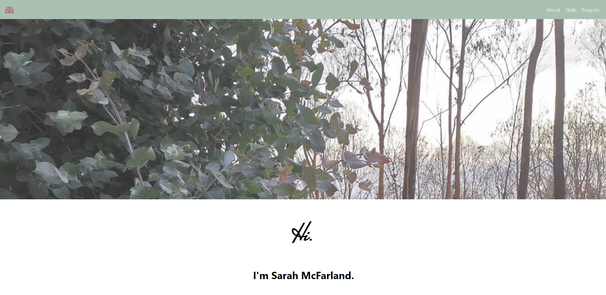

# Portfolio

  

  ## Table of Contents
   
   [ - Description](#description)
 
   [ - Installation](#installation)

   
   [ - Questions](#questions)
  
   [ - License](#license)

 
   ## Description
  A professional portfolio page built with React.
  
  ## Screenshot
  
  
  ## Installation
 Run the command `npm i` to install module dependencies.
 

  ## Usage
 The purpose of this page is to highlight projects and experience I have in web development.
  

  ## Questions
  Feel free to contact me via email, smcfarland2@gmail.com if you have any questions regarding this project. 
  Additionally, my GitHub profile is [SarahHn92](https://github.com/SarahHn92) to view more projects.

  ## License
  The MIT license gives users express permission to reuse code for any purpose, 
sometimes even if code is part of proprietary software. As long as users include the original 
copy of the MIT license in their distribution, they can make any changes or modifications to the 
code to suit their own needs.

